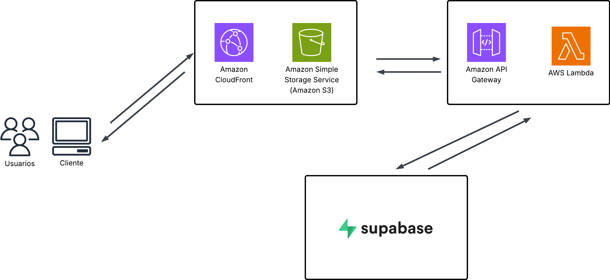
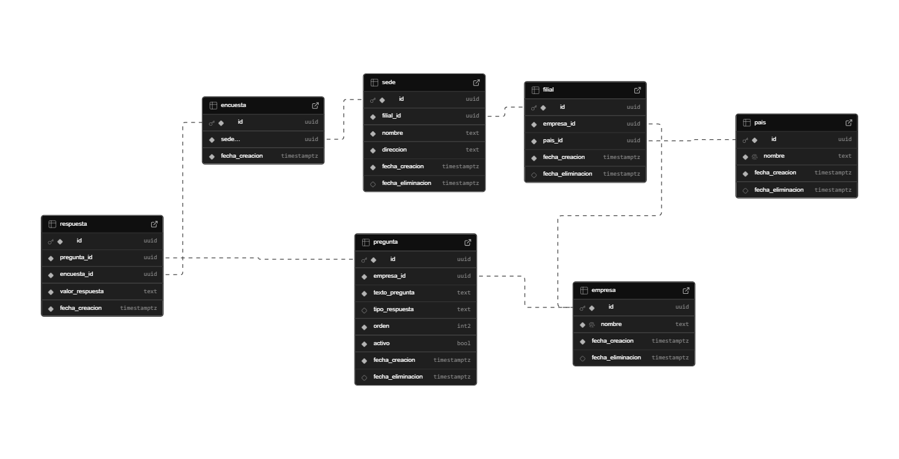

# Opinia - Servicio de encuestas

Opinia es la solución a un problema común de las empresas que buscan medir la satisfacción de sus clientes.

## Despliegue

El proyecto se encuentra desplegado y accesible públicamente en los servicios de aws:

- **Aplicación Web**: [Opinia](https://d3c179xqo0jdvh.cloudfront.net/)
- **Backend (API)**: [Opinia API](https://6kpeior3gl.execute-api.us-east-1.amazonaws.com/dev/api)

## Flujo General del Sistema

El sistema opera mediante un flujo lineal enfocado en la simplicidad para el usuario final:

1. El usuario accede a la aplicación web.
2. La interfaz solicita al Backend los catálogos necesarios (países, empresas y sedes) para configurar el formulario.
3. El usuario completa la encuesta, seleccionando opciones y proporcionando retroalimentación.
4. El Frontend valida los datos y los envía al Backend.
5. El Backend procesa la información y la almacena de forma persistente en la base de datos.

## Arquitectura



## Diseño de Base de Datos



## Decisiones Técnicas

### Frontend

Se siguio una arquitectura de aplicación de una sola pagina utilizando React y Vite para garantizar tiempos de carga rápidos y una experiencia fluida. Se implemento Pico CSS para estilizar la aplicación, por su ligereza y capacidad de ofrecer un diseño limpio y sin la sobrecarga de frameworks más complejos.

### Backend

Se desarrolló una API REST con Express.js para manejar la lógica de negocio. Se eligió esta tecnología por su robustez y facilidad de integración. La arquitectura está modularizada para facilitar el mantenimiento y la escalabilidad.

### Base de Datos

Supabase se utiliza como capa de persistencia debido a su escalabilidad y facilidad de configuración. Se implementaron identificadores UUID para garantizar unicidad global y "soft deletes" para mantener la integridad histórica de los datos.

## Mejoras Futuras

- **Panel de Administración**: Un panel de administración para gestionar empresas, sedes y preguntas sin intervenir en la base de datos directamente.
- **Autenticación**: Sistema de login para roles administrativos.
- **Dashboard de Métricas**: Visualización de datos en tiempo real para analizar la satisfacción por empresa o región.

## Ejecución Local

Instrucciones para ejecutar el proyecto en un entorno de desarrollo.

### Requisitos Previos

- Node.js (Version 18 o superior)
- npm
- Cuenta en Supabase.

### Pasos

1. **Clonar el repositorio**:

   ```bash
   git clone https://github.com/LuisRamirez11/Opinia.git
   ```

2. **Configurar y ejecutar el Backend**:

   ```bash
   cd backend
   npm install
   ```

   Crear un archivo .env en la carpeta backend con las variables: SUPABASE_URL, SUPABASE_SECRET_KEY y PORT.

   ```bash
   npm run dev
   ```

3. **Configurar y ejecutar el Frontend**:
   Abrir una nueva terminal y navegar a la carpeta frontend.
   ```bash
   cd frontend
   npm install
   npm run dev
   ```
